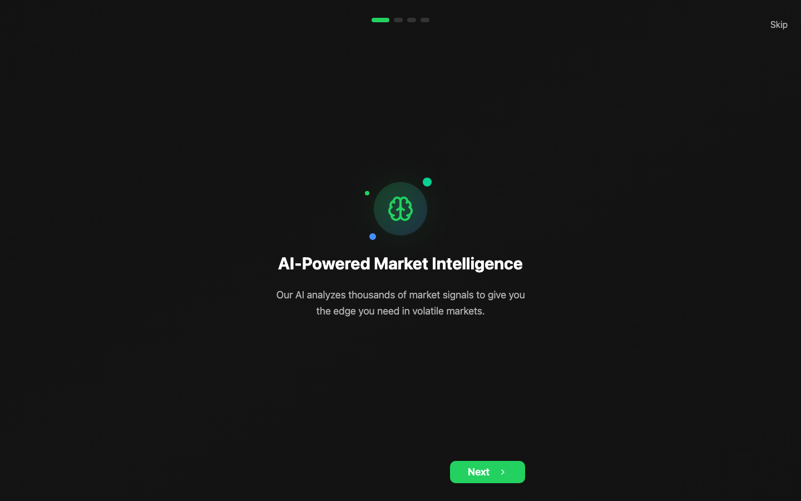

# ArthSetu

**A portfolio-aware investing assistant for Indian retail investors: alerts about the news that affects your holdings, explained in plain language, and a voice agent you can ask about your portfolio.**

Hackathon prototype built with a team. Not deployed.



## The problem

Indian retail investors spread their money across several apps for stocks, mutual funds, news and brokers. Market news is generic and rarely says what it means for the holdings they actually own. So many end up following tips from friends, finfluencers or WhatsApp groups, which leaves them with low confidence and slow, disconnected decisions. This is especially true for first-time investors outside the big cities.

## What it does

- **Imports holdings** from a Zerodha (Kite) account.
- **Tracks prices and market news** and maps events to the user's own holdings.
- **Raises portfolio-specific alerts,** framed as a risk or an opportunity, with an alert history.
- **A voice agent** that answers questions like "What's my portfolio worth?" or "Any alerts today?"
- **Learning content** organised by category, to help investors build confidence over time.

<details>
<summary><strong>Tech stack & running locally</strong></summary>

**Stack:** React, TypeScript, Vite, Tailwind CSS with shadcn/ui, Supabase (Auth, Postgres, Edge Functions), Zerodha Kite Connect, NSE market data, ElevenLabs voice agent.

```bash
npm install
npm run dev
```

</details>
